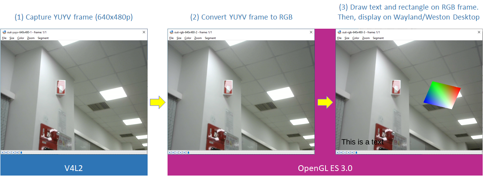

# Camera Image Overlay Demos

## Table of contents

- [Camera Image Overlay Demos](#camera-image-overlay-demos)
  - [Table of contents](#table-of-contents)
  - [Target devices](#target-devices)
  - [Supported cameras](#supported-cameras)
  - [Supported environments](#supported-environments)
  - [Software](#software)
  - [Overview](#overview)
    - [Demo h264-to-file](#demo-h264-to-file)
    - [Demo raw-video-to-lcd](#demo-raw-video-to-lcd)
    - [Demo video-to-lcd-and-file](#demo-video-to-lcd-and-file)
    - [Source code](#source-code)
  - [How to compile demos](#how-to-compile-demos)
  - [How to run demos](#how-to-run-demos)
    - [h264-to-file](#h264-to-file)
    - [raw-video-to-lcd](#raw-video-to-lcd)
    - [video-to-lcd-and-file](#video-to-lcd-and-file)
  - [FAQ](#faq)
  - [Revision history](#revision-history)

## Target devices

- [RZ/G2L Evaluation Board Kit](https://www.renesas.com/eu/en/products/microcontrollers-microprocessors/rz-mpus/rzg2l-evkit-rzg2l-evaluation-board-kit).
- [RZ/V2L Evaluation Board Kit](https://www.renesas.com/us/en/products/microcontrollers-microprocessors/rz-mpus/rzv2l-evkit-rzv2l-evaluation-board-kit).

## Supported cameras

- [Logitech C270 HD Webcam](https://www.logitech.com/en-us/products/webcams/c270-hd-webcam.960-000694.html).
- [Logitech C930e Business Webcam](https://www.logitech.com/en-us/products/webcams/c930e-business-webcam.960-000971.html).
- [Logitech BRIO Ultra HD Pro Business Webcam](https://www.logitech.com/en-us/products/webcams/brio-4k-hdr-webcam.960-001105.html).
- [Logitech C920 HD Pro Webcam](https://www.logitech.com/en-ch/products/webcams/c920-pro-hd-webcam.960-001055.html) (*).
- [Google Coral MIPI OV5645 Camera](https://coral.ai/products/camera/).

(*) The first buffer from the camera is likely to be corrupted.  
Note: Other cameras may also work. Please use at your own risks.

## Supported environments

- [VLP 3.0.2](https://github.com/renesas-rz/meta-renesas/tree/BSP-3.0.2).
- [VLP 3.0.2-update1](https://github.com/renesas-rz/meta-renesas/tree/BSP-3.0.2-update1).
- [VLP 3.0.3](https://github.com/renesas-rz/meta-renesas/tree/BSP-3.0.3).
- [VLP 3.0.6-update2](https://github.com/renesas-rz/meta-renesas/tree/BSP-3.0.6-update2).
- [VLP 3.0.6-update3](https://github.com/renesas-rz/meta-renesas/tree/BSP-3.0.6-update3).

Note: Other environments may also work. Please use at your own risks.

## Software

- **Camera capture:** V4L2, uvcvideo driver (include changes from Renesas to support dmabuf).
- **Text/graphics overlay:** EGL, OpenGL ES (proprietary).
- **H.264 encoding:** OMX IL (proprietary).
- **Display:** Wayland/Weston.

## Overview

The demos explain how to overlay raw video images with text and 2D shape (such as: rectangle). Finally, the images are either encoded to H.264, shown on Wayland/Weston Desktop, or streamed to other device.

| Application | Description |
| ----------- | ----------- |
| h264-to-file | Capture video images from camera -> Overlay the images with text and rectangle -> Encode the images to H.264 data -> Write H.264 data to file. |
| raw-video-to-lcd | Capture video images from camera -> Overlay the images with text and rectangle -> Show the images on Wayland/Weston Desktop. |
| video-to-lcd-and-file | Same as _h264-to-file_ and _raw-video-to-lcd_. The video images are both shown on Wayland/Weston Desktop and encoded to H.264 data which is written to file. |
| h264-to-rtsp | **(To be implemented)** Capture video images from camera -> Overlay the images with text and rectangle -> Encode the images to H.264 data -> Stream with RTSP protocol. |

Note: Camera capture, text/graphics overlay, H.264 encoding, and Wayland/Weston display are hardware accelerated.

### Demo h264-to-file


### Demo raw-video-to-lcd




### Demo video-to-lcd-and-file


For output videos, please refer to _[h264-to-file](#demo-h264-to-file)_ and _[raw-video-to-lcd](#demo-raw-video-to-lcd)_ demos.

### Source code

| Directory | File name | Summary |
| --------- | --------- | ------- |
| common/inc/cglm | *.h | The directory includes header files for [cglm library](https://github.com/recp/cglm/tree/v0.9.0) which provides utils to help math operations to be fast and quick to write. In our case, we are going to use it to create orthographic projection matrix and translation/scale/rotation matrix. |
| common/inc, common/src | egl.h, egl.c | Contain functions that connect/disconnect EGL display, create EGL context, check EGL extensions, and create/delete EGLImage objects. |
| common/inc, common/src | gl.h, gl.c | Contain struct _gl_res_t_, RGB colors (_BLACK_, _WHITE_...), and functions that create shaders, check OpenGL ES extensions, create/delete YUYV and RGB textures, create/delete framebuffers, create/delete resources, convert YUYV textures, draw rectangle, and render text. |
| common/inc, common/src | mmngr.h, mmngr.c | Contain structs: _mmngr_dmabuf_exp_t_, _mmngr_buf_t_, and functions that allocate/free NV12 buffers. |
| common/inc, common/src | omx.h, omx.c | Contain macros that calculate stride, slice height from video resolution and functions that wait for OMX state, get/set input/output port, allocate/free buffers for input/output ports... |
| common/inc, common/src | queue.h, queue.c | Contain struct _queue_t_ and functions that create/delete queue, check if queue is empty or full, enqueue/dequeue element to/from queue. |
| common/inc, common/src | ttf.h, ttf.c | Contain struct _glyph_t_ and functions that generate/delete an array of _glyph_t_ objects from TrueType font file. |
| common/inc, common/src | v4l2.h, v4l2.c | Contain struct _v4l2_dmabuf_exp_t_ and functions that open/verify device, get/set format and framerate, allocate/free buffers, enqueue/dequeue buffers, enable/disable capturing... |
| common/inc, common/src | wl.h, wl.c | Contain structs: _wl_display_t_, _wl_window_t_, and functions that connect/disconnect Wayland display, create/delete window. |
| common/inc, common/src | util.h, util.c | Contain utility functions. |
| common/inc, common/src | prog.h, prog.c | Contain program functions. |
| common/ttf | LiberationSans-Regular.ttf | [TrueType font](https://releases.pagure.org/liberation-fonts/liberation-fonts-ttf-2.00.1.tar.gz). |
| h264-to-file | h264-to-file.sh, main.c | Demo _h264-to-file_. The script file will run the demo after reprobing uvcvideo with parameter _allocators=1_. Without it, video frames will contain noises. |
| h264-to-file | yuyv-to-rgb.vs.glsl, yuyv-to-rgb.fs.glsl | Convert YUYV textures to RGB. |
| h264-to-file | rectangle.vs.glsl, rectangle.fs.glsl | Draw rectangle on RGB texture. |
| h264-to-file | text.vs.glsl, text.fs.glsl | Draw text on RGB texture. |
| h264-to-file | rgb-to-nv12.vs.glsl, rgb-to-nv12.fs.glsl | Convert RGB textures to NV12. |
| raw-video-to-lcd | raw-video-to-lcd.sh, main.c | Demo _raw-video-to-lcd_. |
| raw-video-to-lcd | yuyv-to-rgb.vs.glsl, yuyv-to-rgb.fs.glsl | Convert YUYV textures to RGB. |
| raw-video-to-lcd | rectangle.vs.glsl, rectangle.fs.glsl | Draw rectangle on RGB texture. |
| raw-video-to-lcd | text.vs.glsl, text.fs.glsl | Draw text on RGB texture. |
| video-to-lcd-and-file | video-to-lcd-and-file.sh, main.c | Demo _video-to-lcd-and-file_. The script file will run the demo after reprobing uvcvideo with parameter _allocators=1_. Without it, video frames will contain noises. |
| video-to-lcd-and-file | yuyv-to-rgb.vs.glsl, yuyv-to-rgb.fs.glsl | Convert YUYV textures to RGB. |
| video-to-lcd-and-file | rectangle.vs.glsl, rectangle.fs.glsl | Draw rectangle on RGB texture. |
| video-to-lcd-and-file | text.vs.glsl, text.fs.glsl | Draw text on RGB texture. |
| video-to-lcd-and-file | render-rgb.vs.glsl, render-rgb.fs.glsl | Draw RGB texture on default framebuffer. |
| video-to-lcd-and-file | rgb-to-nv12.vs.glsl, rgb-to-nv12.fs.glsl | Convert RGB textures to NV12. |

## How to compile demos

**Note 1:** The SDK must be generated from either _core-image-weston_ or _core-image-qt_.  
**Note 2:** If using SDK v3.0.4 or older, please add the following lines to _build/conf/local.conf_. Then, generate the SDK.

  ```c
  DISTRO_FEATURES_NATIVESDK_append = " wayland"
  DISTRO_FEATURES_NATIVESDK_remove = " x11"
  ```

- Source the environment setup script of SDK:

  ```bash
  user@ubuntu:~$ source /path/to/sdk/environment-setup-aarch64-poky-linux
  ```

- Go to directory _demo-camera-image-overlay_ and run _make_ command:

  ```bash
  user@ubuntu:~$ cd demo-camera-image-overlay
  user@ubuntu:~/demo-camera-image-overlay$ make
  ```

- After compilation, the demos should be in directories _h264-to-file_, _raw-video-to-lcd_, and _video-to-lcd-and-file_.

  ```bash
  h264-to-file/
  ├── h264-to-file.sh
  ├── main
  ├── rectangle.fs.glsl
  ├── rectangle.vs.glsl
  ├── rgb-to-nv12.fs.glsl
  ├── rgb-to-nv12.vs.glsl
  ├── text.fs.glsl
  ├── text.vs.glsl
  ├── yuyv-to-rgb.fs.glsl
  ├── yuyv-to-rgb.vs.glsl
  └── LiberationSans-Regular.ttf

  raw-video-to-lcd/
  ├── raw-video-to-lcd.sh
  ├── main
  ├── rectangle.fs.glsl
  ├── rectangle.vs.glsl
  ├── text.fs.glsl
  ├── text.vs.glsl
  ├── yuyv-to-rgb.fs.glsl
  ├── yuyv-to-rgb.vs.glsl
  └── LiberationSans-Regular.ttf

  video-to-lcd-and-file/
  ├── LiberationSans-Regular.ttf
  ├── main
  ├── rectangle.fs.glsl
  ├── rectangle.vs.glsl
  ├── render-rgb.fs.glsl
  ├── render-rgb.vs.glsl
  ├── rgb-to-nv12.fs.glsl
  ├── rgb-to-nv12.vs.glsl
  ├── text.fs.glsl
  ├── text.vs.glsl
  ├── video-to-lcd-and-file.sh
  ├── yuyv-to-rgb.fs.glsl
  └── yuyv-to-rgb.vs.glsl
  ```

## How to run demos

### h264-to-file

- After [compilation](#how-to-compile-demos), copy _h264-to-file_ directory to _/home/root/_ directory of RZ/G2L or RZ/V2L board.  
Then, run the following commands:

  ```bash
  root@smarc-rzv2l:~# cd ~/h264-to-file
  root@smarc-rzv2l:~/h264-to-file# chmod 755 h264-to-file.sh
  root@smarc-rzv2l:~/h264-to-file# chmod 755 main
  ```

- If you are using USB camera, please run this command next:

  ```bash
  root@smarc-rzv2l:~/h264-to-file# ./h264-to-file.sh -d /dev/video0 -w 640 -h 480
  ```

- Otherwise, if you are using MIPI camera, please run these commands next:

  ```bash
  root@smarc-rzv2l:~/h264-to-file# cd ~
  root@smarc-rzv2l:~# sed -i -E 's/^#ov5645_res=1280x960/ov5645_res=1280x960/g' v4l2-init.sh
  root@smarc-rzv2l:~# sed -i -E 's/^ov5645_res=1920x1080/#ov5645_res=1920x1080/g' v4l2-init.sh
  root@smarc-rzv2l:~# sed -i -E 's/^ov5645_res=2592x1944/#ov5645_res=2592x1944/g' v4l2-init.sh
  root@smarc-rzv2l:~# ./v4l2-init.sh

  root@smarc-rzv2l:~# cd ~/h264-to-file
  root@smarc-rzv2l:~/h264-to-file# ./h264-to-file.sh -d /dev/video0 -w 1280 -h 960
  ```

- The _h264-to-file.sh_ script should generate the below messages:

  ```bash
  root@smarc-rzv2l:~/h264-to-file# ./h264-to-file.sh -d /dev/video0 -w 640 -h 480
  Removing 'uvcvideo' from kernel
  Adding 'uvcvideo' to kernel
  Running sample application
  V4L2 device:
    Name: 'UVC Camera (046d:0825)'
    Bus: 'usb-11c70100.usb-1.2'
    Driver: 'uvcvideo (v5.10.158)'
  V4L2 format:
    Frame width (pixels): '640'
    Frame height (pixels): '480'
    Bytes per line: '1280'
    Frame size (bytes): '614400'
    Pixel format: 'YUYV'
    Scan type: 'Progressive'
  V4L2 framerate: '30.000'
  OMX media component's role: 'video_encoder.avc'
  OMX state: 'OMX_StateIdle'
  OMX state: 'OMX_StateExecuting'
  EmptyBufferDone exited
  FillBufferDone exited
  FillBufferDone exited
  EmptyBufferDone exited
  FillBufferDone exited
  ...
  ^CEmptyBufferDone exited
  FillBufferDone exited
  OMX event: 'End-of-Stream'
  FillBufferDone exited
  Thread 'thread_input' exited
  Thread 'thread_output' exited
  FillBufferDone exited
  OMX state: 'OMX_StateIdle'
  OMX state: 'OMX_StateLoaded'
  ```

- Press Ctrl-C to exit the demo. The output video will also be generated:

  ```bash
  root@smarc-rzv2l:~/h264-to-file# ls -l out*
  -rw-r--r-- 1 root root 287961 Sep 20 11:08 output.264
  ```

- You can open it with [Media Classic Player](https://mpc-hc.org/) on Windows (recommended), [Videos application](https://manpages.ubuntu.com/manpages/trusty/man1/totem.1.html) on Ubuntu, or GStreamer pipeline on [VLP environment](#supported-environments) as below:

  ```bash
  gst-launch-1.0 filesrc location=output.264 ! h264parse ! omxh264dec ! waylandsink
  ```

**Notes:**

- For **MIPI camera**, resolutions other than **1280x960** are not guaranteed to work.
- If you are using **MIPI camera**, you can run _main_ binary directly. The options are the same as those in _h264-to-file.sh_ script.
- For **MIPI camera**, before running _v4l2-init.sh_ script, please ensure `1280x960` resolution is set to `ov5645_res` variable and other resolutions are commented out. The output message should be:

  ```bash
  root@smarc-rzv2l:~# ./v4l2-init.sh
  Link CRU/CSI2 to ov5645 0-003c with format UYVY8_2X8 and resolution 1280x960
  ```

- When using **MIPI camera**, the sample apps will display the following error message. This occurs because the apps attempt to print framerate value, but the **MIPI camera** does not support. This message is harmless and can be ignored.

  ```text
  Error: 'Inappropriate iotctl for device' (code: '25')
  ```

- For **USB camera**, resolutions other than **640x480** are not guaranteed to work.
- The default framerate is `30/1`. However, you can use `-f` option in _h264-to-file.sh_ script to specify a custom framerate **for USB camera**. You must specify the framerate in the format of a `fraction value` to correctly set the desired framerate. If it's not supported, the V4L2 framework will select the closest available.

  ```bash
  root@smarc-rzv2l:~/h264-to-file# ./h264-to-file.sh -f 20/1
  ```

- If you don't specify options in _h264-to-file.sh_ script, the script will assume you are using USB camera and will use default settings, such as: `/dev/video0` camera device file, `640x480` resolution, and `30/1` FPS.
- If you connect both a MIPI and a USB camera simultaneously, their device files will be `/dev/video0` and `/dev/video1`, respectively.

### raw-video-to-lcd

- After [compilation](#how-to-compile-demos), copy _raw-video-to-lcd_ directory to _/home/root/_ directory of RZ/G2L or RZ/V2L board.  
Then, run _raw-video-to-lcd.sh_ script with options similar to _[h264-to-file.sh](#h264-to-file)_ script.

- The _raw-video-to-lcd.sh_ script should generate the below messages:

  ```bash
  root@smarc-rzv2l:~/raw-video-to-lcd# ./raw-video-to-lcd.sh -d /dev/video0 -w 640 -h 480
  Removing 'uvcvideo' from kernel
  Adding 'uvcvideo' to kernel
  Running sample application
  V4L2 device:
    Name: 'UVC Camera (046d:0825)'
    Bus: 'usb-11c70100.usb-1.2'
    Driver: 'uvcvideo (v5.10.158)'
  V4L2 format:
    Frame width (pixels): '640'
    Frame height (pixels): '480'
    Bytes per line: '1280'
    Frame size (bytes): '614400'
    Pixel format: 'YUYV'
    Scan type: 'Progressive'
  V4L2 framerate: '30.000'
  149 frames in 5 seconds: 29.8 fps
  149 frames in 5 seconds: 29.8 fps
  ...
  ```

- The demo should be shown on Wayland/Weston desktop. You can press Ctrl-C to exit the demo.

### video-to-lcd-and-file

- Please refer to [h264-to-file](#h264-to-file) and [raw-video-to-lcd](#raw-video-to-lcd) sections.

## FAQ

- Q1: How to fix the below compilation error?

  ```bash
  user@ubuntu:~/demo-camera-image-overlay$ make
  ...
  wayland-scanner code /usr/share/wayland-protocols/stable/xdg-shell/xdg-shell.xml common/src/xdg-shell-protocol.c
  Could not open input file: No such file or directory
  Makefile:68: recipe for target 'common/src/xdg-shell-protocol.c' failed
  make: *** [common/src/xdg-shell-protocol.c] Error 1
  ```

- A1: The _make_ command needs the _wayland-scanner_ tool to generate the _xdg-shell-protocol.c_ file from the _xdg-shell.xml_ file. But the XML file doesn't exist, so the tool crashes and the compilation stops. To fix this, make sure you are using the SDK generated from _core-image-weston_ or _core-image-qt_.

- Q2: How to fix "wayland-scanner: Command not found"?

  ```console
  user@ubuntu:~/demo-camera-image-overlay$ make
  ...
  make: wayland-scanner: Command not found
  make: *** [Makefile:68: common/src/xdg-shell-protocol.c] Error 127
  ```

- A2: The _make_ command needs the _wayland-scanner_ tool. This is installed in the SDK if you modified the local.conf as mentioned in the instructions (added " wayland", removed " x11"). However, you can also just install the tool manually by using the command below.

  ```console
  $ sudo apt-get install libwayland-dev
  ```

## Revision history

| Version | Date | Summary |
| ------- | ---- | ------- |
| 1.0 | Jan 05, 2023 | Add demo _h264-to-file_. However, it only encodes 1 frame and outputs 1 H.264 frame. It also outputs 3 raw frame for debugging purposes. |
| 1.1 | Feb 23, 2023 | Demo _h264-to-file_ is able to encode multiple frames and outputs 1 H.264 video. |
| 1.2 | Mar 14, 2023 | Convert demo _h264-to-file_ to multi-threaded application for better performance. |
| 2.0 | Apr 06, 2023 | Add demo _raw-video-to-lcd_. |
| 2.1 | Apr 26, 2023 | Render text and transform rectangle. |
| 3.0 | Jul 31, 2023 | Add demo _video-to-lcd-and-file_. |
| 3.1 | Nov 14, 2024 | Add options to support both USB and MIPI cameras. |
